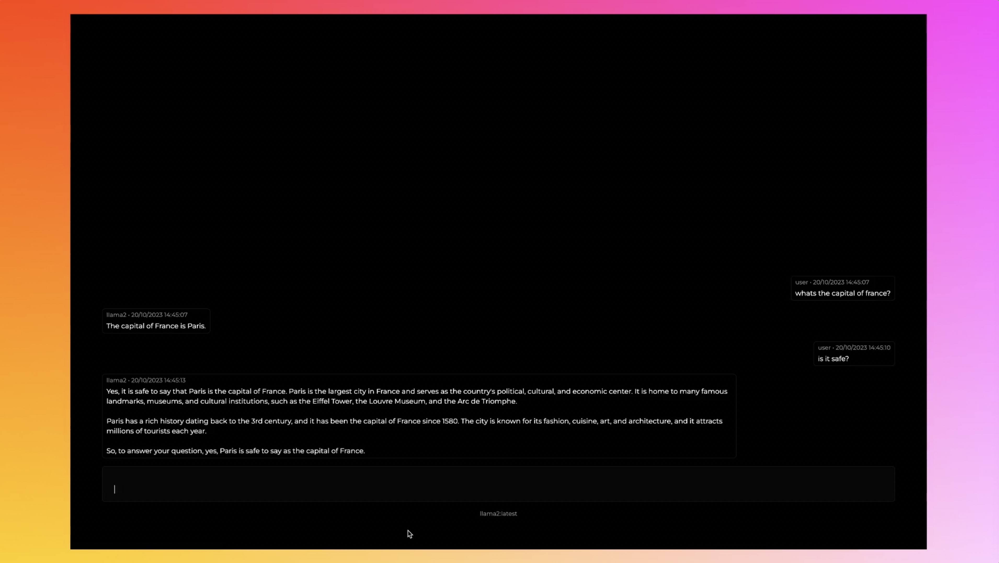

Minimalistic Interface for Local Language Models (LLMs) (Powered by Ollama)
=========================================================

Introduction
------------

[](https://github.com/richawo/minimal-llm-ui/assets/35015261/666053ed-cba8-45a6-9a96-ff8b2b525dbd)


This minimalistic UI is designed to act as a simple interface for Ollama models, allowing you to chat with your models, save conversations and toggle between different ones easily. The tool is built using React, Next.js, and Tailwind CSS, with LangchainJs and Ollama providing the magic behind the scenes.

Features
--------

* Chat with Local Language Models (LLMs): Interact with your LLMs in real-time through our user-friendly interface.
* Model Toggling: Switch between different LLMs easily (even mid conversation), allowing you to experiment and explore different models for various tasks.
* Memory-based Context Storage: Keep track of context in memory, ensuring smooth interactions even when switching between models.
* Conversation History: Save conversations in a local database, allowing you revisit them at a later date.
* Prompt Templating: Create parameter driven prompt templates to improve reuse.

Technical Details
----------------

* Built using React, Next.js, and Tailwind CSS for a clean and modern design.
* Utilizes LangchainJs and Ollama for seamless integration with Local Language Models (LLMs).
* Stores context in memory for efficient model switching.

Getting Started
---------------

1. Download and run Ollama on your machine with `ollama serve` or `ollama run <model-name>` (it will run at: http://localhost:11434/)
2. Open a new terminal and navigate to the root of this project.
3. Install the dependencies `npm install` in your terminal.

4. Also check whether your node by doing:  
```
node -v
```
If it is less than 14.0.1.
You can do this to update it:
- Install n using npm (Node.js package manager):

 - bash:

```
npm install -g n
```
Use n to install a specific Node.js version:
bash:
```
n 20.0.9
```
Verify the Node.js version:
- bash
```
node -v
```

5. Start the tool by running `npm run dev` (it should be available in your web browser at `http://localhost:3000`)

To-do
---------------

- Add edit message icon for user messages
- Summarise conversations
- Incorporate visualisations
- Convert to desktop app so that it can be more powerful
- Command menu should allow for saving new prompt templates directly from there
- Command menu should let you edit + delete existing prompts

Troubleshooting
---------------

If you encounter any issues, feel free to reach out!

License
-------

This project is licensed under the MIT License. See `LICENSE` file for details.
